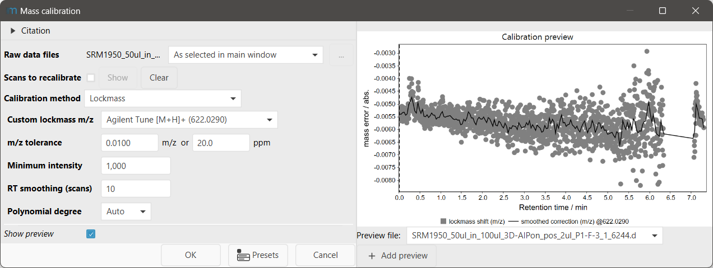
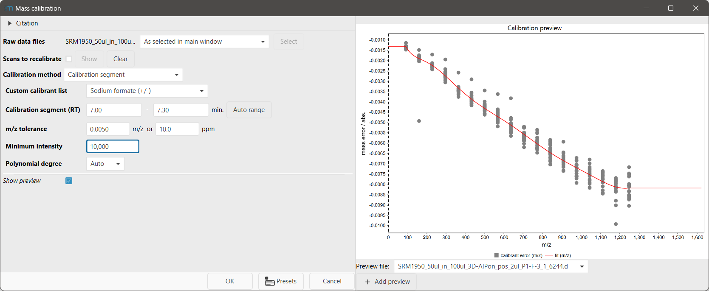
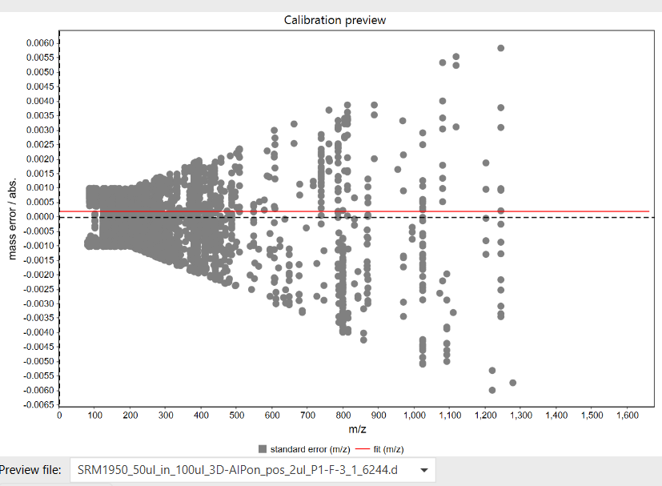

# Mass calibration

:material-menu-open: **Raw data methods → Mass detection → Mass calibration**

Mass calibration corrects the centroided m/z values stored in scan mass lists. For every selected
raw data file, mzmine first estimates the mass error from known reference ions and then applies the
resulting calibration to the selected scans. The reference ions can be continuous lockmasses, a
calibrant mixture measured during a defined retention-time segment, or internal standards and
known contaminants distributed through the run.

!!! warning

    Run [Mass detection](../featdet_mass_detection/mass-detection.md) before mass calibration.
    Every selected scan must have a mass list. The module replaces the mass list associated with
    each selected scan; peak intensities are retained while the m/z values are recalibrated.

!!! tip

    Use the calibration preview before running the module. A small residual alone is not sufficient:
    the reference matches should cover the retention-time and m/z ranges that matter for the
    experiment.

## Recommended citations

!!! info

    When using the bundled Agilent Tune Mix calibrants, please also cite Stow et al.
    [https://doi.org/10.1021/acs.analchem.7b01729](https://doi.org/10.1021/acs.analchem.7b01729).

    When using the bundled Universal calibrants, please cite Keller et al. (2008), Hawkes et al.
    (2020), or both, according to the selected list.

---

## Choosing a calibration method

Choose the method from how the reference ions were acquired, not only from which model gives the
smallest residual.

| Calibration method                    | Use it when                                                                                                                                           | Calibration produced                                                                                                         |
|---------------------------------------|-------------------------------------------------------------------------------------------------------------------------------------------------------|------------------------------------------------------------------------------------------------------------------------------|
| **Lockmass**                          | One or more known reference ions are present repeatedly throughout the run. This is the preferred choice when mass error changes with retention time. | A retention-time-dependent correction. With multiple lockmasses, the correction may also vary with m/z.                      |
| **Calibration segment**               | A calibrant or tune mixture was introduced during one known retention-time window, for example at the beginning or end of the acquisition.            | One m/z-dependent polynomial fitted from that segment and applied to the whole file. It does not model retention-time drift. |
| **Internal standards / contaminants** | Known ions occur at different retention times across the sample and can be described by m/z and, optionally, expected retention time.                 | One file-wide constant or m/z-dependent error model. It does not model retention-time drift.                                 |

A practical decision sequence is:

1. Lockmass or calibration segment. If a lockmass is measured repeatedly through the run, start with
   **Lockmass**. Otherwise, if a calibrant mixture occurs in a defined acquisition window, use
   **Calibration segment**.
2. Otherwise, use **Internal standards / contaminants** when enough known ions can be matched
   confidently across the file. Prefer internal standards or specifically known compounds to a
   universal calibrant list what is not specific to your sample.

!!! warning

    All three strategies avoid extrapolating the correction beyond their supported m/z range.
    Peaks below or above the matched calibrant range receive the correction at the nearest range
    boundary. Calibrants should therefore span the analyte m/z range whenever possible.

---

## Parameters

### Common parameters

#### Raw data files

Select the raw data files to recalibrate. MZmine builds an independent calibration and starts a
separate task for each file.

#### Scans to recalibrate

Select the scans whose mass lists will be replaced by recalibrated mass lists. The default is
**all scans**, including MS1 and MSn scans.

The calibration itself is estimated from MS1 scans. If MSn scans are selected, the same file-level
model is applied to them. For lockmass calibration, a scan outside the retention-time range of the
observed lockmass anchors uses the correction from the closest available retention time.

#### Calibration method

Select **Lockmass**, **Calibration segment**, or **Internal standards / contaminants**. The dialog
shows only the parameters that belong to the selected strategy.

### Lockmass parameters



*Example lockmass settings and the retention-time-dependent calibration preview.*

!!! note "Waters QTOF lockmass correction during import"

    Waters QTOF raw data with a lockmass function are normally lockmass-corrected during import.
    MZmine can use the known calibrant information stored with the acquisition or the
    polarity-specific lockmass configured in the **Waters MassLynx data import** preferences or
    vendor-specific import parameters. Check the import settings before running this module so an
    already corrected file is not unintentionally calibrated a second time.

#### Lockmass m/z

Choose a predefined lockmass or select **Custom m/z** and enter one or more comma-separated m/z
values. The default is **Leucine enkephalin [M+H]+ (556.2766)**. Presets are also available for
negative-mode leucine enkephalin and several Agilent Tune ions.

With one lockmass, the correction is constant over m/z but can change with retention time. Multiple
lockmasses are required to fit an m/z-dependent correction within each spectrum.

#### m/z tolerance

Search window around each expected lockmass. The default is **0.01 Da / 20 ppm**. Use a tolerance
wide enough to include the uncalibrated reference peak but narrow enough to avoid unrelated ions.
For every lockmass and MS1 scan, the most intense qualifying peak is used.

#### Minimum intensity

Ignore lockmass candidates below this intensity. The default is **0**, which does not impose an
additional intensity threshold beyond mass detection.

#### RT smoothing (scans)

Number of lockmass spectra used by the centered moving average that smooths the correction over
retention time. The default is **5**. A value of **1** disables smoothing. Larger values suppress
single-scan outliers but may also smooth genuine rapid drift. Use an odd number; an even value is
internally increased to the next odd number.

#### Polynomial degree

Degree of the per-spectrum polynomial that models absolute m/z error over measured m/z. The default
is 0.
**Auto** selects the degree with the lowest pooled residual, but may lead to overfitting. A fixed
degree cannot exceed the number of configured lockmasses minus one. If individual spectra contain
too few matched lockmasses, mzmine reduces the usable degree.

We recommend using a single lockmass and a polynomial degree of 0, as these are easy to inspect in
the preview.

### Calibration segment parameters



*Example calibration-segment settings and the fitted m/z-dependent correction.*

This calibration technique is frequently used on Bruker QTOF devices with a syringe loop injection
before or after the elution of the sample.

#### Calibrant list

Choose a bundled sodium formate or Agilent Tune Mix list, or select **Custom file**. The default is
**Sodium formate (+/-)**. See [Custom calibrant list format](#custom-calibrant-list-format) for the
required file columns.

#### Calibration segment (RT)

Retention-time window in minutes during which the calibrant mixture was measured. Only MS1 mass
lists in this window are used to fit the calibration. The default is **0.0–1.0 min**.

#### m/z tolerance

Matching tolerance between reference and measured calibrant m/z. The default is
**0.005 Da / 10 ppm**.

#### Minimum intensity

Ignore calibrant candidates below this intensity. The default is **0**.

#### Polynomial degree

Degree of the single polynomial fitted from all calibrant matches in the segment. The default is
**Auto**, which selects the lowest-residual degree while keeping the fit over-determined. Use the
preview to check that the selected curvature is supported across the matched m/z range.

The optional RT column in a custom list is not used by this strategy because the calibration
segment itself constrains retention time.

### Internal standards / contaminants parameters

#### Standards list

Choose a bundled Universal calibrant list for the relevant polarity and source publication, a
merged Universal list, or **Custom file**. The default is **Universal calibrants merged (+)**.

!!! warning "Do not apply a funnel-shaped Universal-calibrant calibration"

    If the Universal calibrants form a funnel-shaped distribution in the preview, the matches are
    unspecific rather than a coherent mass-error trend. Do not apply the resulting calibration.
    Use a more specific calibrant list, add retention-time constraints where available, or tighten
    the matching parameters until the preview shows a defined error relationship.

    The funnel shape orignates from the allowed m/z tolerance. For low masses the absolute tolerance
    dominates, while the ppm tolerance grows with increasing m/z.



*A funnel-shaped match distribution indicates unspecific Universal-calibrant matching and must not
be used for calibration.*

#### m/z tolerance

Matching tolerance between standard and measured m/z. The default is **0.001 Da / 5 ppm**.

#### RT tolerance

Maximum retention-time difference between a measured peak and a standard with an expected RT. The
default is **0.2 min**. Standards without an RT are matched independently of retention time.

#### Minimum intensity

Ignore candidate peaks below this intensity. The default is **0**.

#### Calibration method

Select the error model used for the file-wide correction. The default is **Arithmetic mean**. See
[Choosing an internal-standard error model](#choosing-an-internal-standard-error-model) for method
selection guidance.

Additional parameters depend on the selected model:

- **KNN neighbors (%)**: percentage of matched points used as neighbors. The default is **10%**.
- **Polynomial degree**: degree of the OLS model. The default is **Auto**.
- **Auto** exposes both settings because it evaluates the configured KNN and OLS candidates along
  with the arithmetic mean.

#### Choosing an internal-standard error model

The **Internal standards / contaminants** strategy offers four ways to model error over m/z.

| Error model                | Recommended use                                                                                                                                 | Important consideration                                                                                                                                                                            |
|----------------------------|-------------------------------------------------------------------------------------------------------------------------------------------------|----------------------------------------------------------------------------------------------------------------------------------------------------------------------------------------------------|
| **Arithmetic mean**        | A small number of matches, approximately constant mass error, blanks, or uneven m/z coverage. This is the default and most conservative option. | Uses one constant offset: the arithmetic mean of the middle 50% of matched absolute errors. It cannot model an m/z-dependent trend.                                                                |
| **KNN regression**         | Many well-distributed matches show a local or non-polynomial trend over m/z.                                                                    | A smaller neighbor percentage follows local variation more closely but is more sensitive to individual matches. A larger percentage produces a smoother, more stable trend.                        |
| **OLS regression**         | Matches cover the relevant m/z range and show a smooth global trend that is reasonably described by a polynomial.                               | High polynomial degrees and sparse edge regions can overfit. Prefer a low degree unless the preview clearly supports more curvature.                                                               |
| **Auto (lowest residual)** | A convenient first comparison when there are enough trustworthy matches.                                                                        | Fits the mean, KNN, and OLS candidates and selects the lowest in-sample sum of squared residuals. This is not cross-validation and can favor an overly flexible model; always inspect the preview. |

### Custom calibrant list format

Custom calibration-segment and internal-standard lists may be comma-, tab-, or otherwise
automatically delimited text files. Include a required `mz` column and an optional `rt` column in
minutes:

```text
mz,rt
121.0502,1.35
195.0877,4.72
556.2766,
```

For **Internal standards / contaminants**, a missing RT makes that calibrant RT-independent. For
**Calibration segment**, RT values in the file are ignored.

---

## Calibration preview

Select a raw data file in the preview controls. The preview is recalculated from the current method
and parameter values.

| Method                                | Preview x-axis       | Preview content                                                                           |
|---------------------------------------|----------------------|-------------------------------------------------------------------------------------------|
| **Lockmass**                          | Retention time (min) | Matched lockmass errors and the smoothed correction for each configured lockmass.         |
| **Calibration segment**               | m/z                  | Matched calibrant errors and the fitted polynomial.                                       |
| **Internal standards / contaminants** | m/z                  | Matched standard errors and the selected mean, KNN, OLS, or automatically selected model. |

Before accepting the settings, check that:

- reference matches are numerous enough and occur where expected;
- the model follows the central error trend rather than isolated points;
- the matched references cover the analyte m/z range;
- a lockmass model remains supported across the relevant retention-time range; and
- high curvature near an unsupported edge is not driving the correction.

An empty preview usually indicates missing mass lists, the wrong polarity or reference list, a
lockmass that is absent from the file, an overly narrow m/z/RT tolerance, or an intensity threshold
above the reference peaks.

---

## Algorithm {#algorithm}

All strategies model the absolute mass error in daltons:

$$
\Delta(m/z, t_R) = m/z_{\mathrm{measured}} - m/z_{\mathrm{reference}}
$$

The calibrated value is:

$$
m/z_{\mathrm{calibrated}} = m/z_{\mathrm{measured}} - \widehat{\Delta}(m/z, t_R)
$$

The strategies differ in how they estimate $\widehat{\Delta}$:

- **Lockmass** matches the most intense qualifying peak for each lockmass in each MS1 scan. It fits
  per-spectrum polynomial coefficients and smooths those coefficients over retention time.
- **Calibration segment** pools calibrant matches from MS1 scans in the selected RT window and fits
  one retention-time-independent polynomial.
- **Internal standards / contaminants** pools standard matches across all MS1 scans and fits the
  selected constant, KNN, or polynomial model.

For calibration-segment and internal-standard matching, MZmine keeps the highest-intensity peak per
calibrant in each spectrum. A peak that falls within tolerance of more than one calibrant is treated
as ambiguous and is not used.

After the model is established, MZmine recalibrates every m/z value in the selected mass lists while
retaining the intensities. For ion-mobility frames, the mobility-scan mass-list m/z values are also
recalibrated. The operation is recorded in the raw data file's list of applied methods.

If no valid calibration can be established, the task stops with an error. Typical causes are no
lockmass or standard matches, fewer than two calibration-segment matches, an unreadable or empty
custom calibrant list, or a failed polynomial fit.

---

{{ git_page_authors }}
